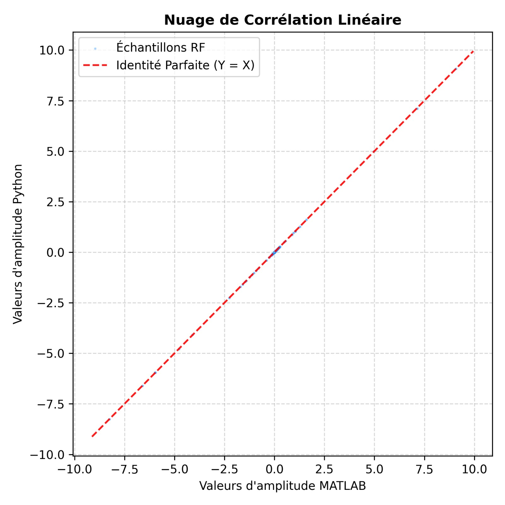
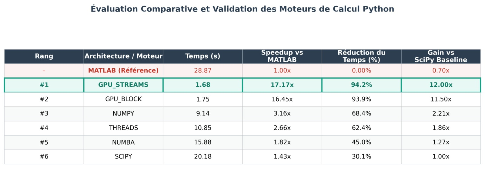
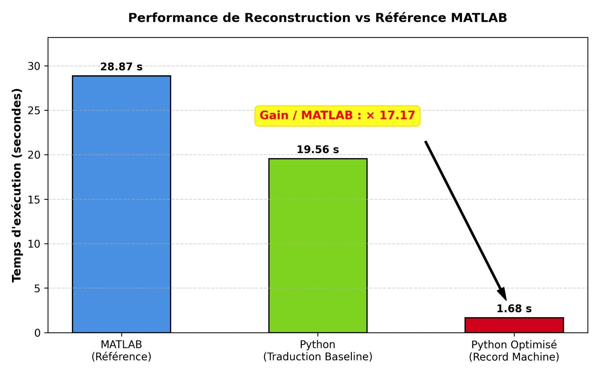
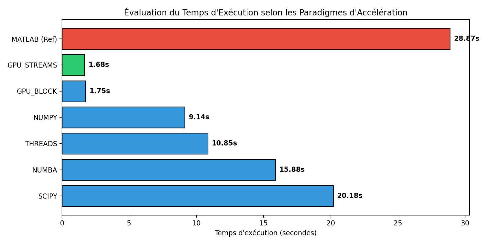

# Journal des Performances et Suivi du Code : Micro-Beamforming

- **Date de référence :** 21 mai 2026
- **Configuration de test :** Serveur SRV07

## 1. Phase d’Exploration : Journal des Performances Initiales

Ce premier tableau retrace les premiers essais du stage. Les temps ont été mesurés en lançant le script une seule fois, sans exécution à vide au démarrage (pas de warm-up). Ce tableau prend donc en compte le temps que met Python à charger les bibliothèques et à compiler le code la toute première fois.

| Version du Code | Environnement | Technologie / Bibliothèque | Temps de Calcul | Speedup (vs Baseline Python) | Speedup Global (vs MATLAB) | Réduction du Temps (vs Baseline) | Analyse technique et modifications apportées | Étape suivante du stage |
| :--- | :--- | :--- | :--- | :--- | :--- | :--- | :--- | :--- |
| **`beamform_sorbet_micro.m`** | MATLAB | Code original de référence | **28.87 s** | *N/A* | *Référence absolue* | *N/A* | Code de base fourni par le laboratoire pour vérifier que les futures versions Python donnent les mêmes résultats. | Point de départ de l'étude. |
| **`beamform_sorbet_micro.py`** *(Baseline)* | Python (CPU) | [`scipy.interpolate.interp1d`](https://docs.scipy.org/doc/scipy/reference/generated/scipy.interpolate.interp1d.html) | **19.45 s** | **1.00x** *(Réf)* | **1.48x** | **0.00 %** | Traduction ligne par ligne du code MATLAB en Python. Les résultats sont validés par un calcul de corrélation (0.999995). | Lancement d'un premier profilage avec cProfile pour voir quelles fonctions prennent du temps. |
| **Profilage de la Baseline** | Analyse CPU | [`cProfile`](https://docs.python.org/3/library/profile.html) + [`matplotlib`](https://matplotlib.org/) | *N/A (Analyse)* | *N/A* | *N/A* | *N/A* | L'analyse montre que la fonction d'interpolation de SciPy (`__init__`, `__call__`) prend plus de 7 secondes à elle seule à cause de la création répétée d'objets. | Remplacement de l'interpolation SciPy par la fonction `numpy.interp` pour simplifier. |
| **Optimisation 1** | Python (CPU) | Remplacement par [`numpy.interp`](https://numpy.org/doc/stable/reference/generated/numpy.interp.html) | **15.90 s** | **1.22x** | **1.82x** | **18.25 %** | Le calcul direct avec NumPy évite la création d'objets lourds. Le temps descend à 15.90 s. | Lancement d'un nouveau profilage pour voir ce qui bloque encore. |
| **Profilage de l'Optimisation 1** | Analyse CPU | Profilage incrémental (`cProfile` + CSV) | *N/A (Analyse)* | *N/A* | *N/A* | *N/A* | SciPy a disparu des fonctions coûteuses. Le problème vient maintenant de la boucle `for` principale en Python qui se répète 30 720 fois et prend 12.67 s. | Essai de parallélisation de la boucle sur plusieurs cœurs CPU avec des Threads. |
| **Optimisation 2** | Python (CPU Multi-threads) | [`concurrent.futures.ThreadPoolExecutor`](https://docs.python.org/3/library/concurrent.futures.html) | **18.92 s** | **0.86x** *(Régression)* | **1.53x** | **-34.46 %** | Le temps augmente car les threads passent leur temps à s'attendre à cause du verrou interne de Python (le GIL). Cette limite classique de Python pour le calcul intensif est expliquée dans l'atelier du [Centre de Calcul du CNES](https://sourcesup.renater.fr/wiki/atelieromp/_media/20221201_atelier_omp_optimisation_code_python.pdf). | Le multi-threading classique ne fonctionne pas ici. Essai de la compilation JIT avec Numba qui permet de contourner ce verrou. |
| **Profilage du Multi-threading** | Analyse CPU Parallèle | `cProfile` dédié Threads + CSV | *N/A (Analyse)* | *N/A* | *N/A* | *N/A* | Les fonctions de blocage des threads (`wait` et `lock.acquire`) cumulent plus de 7 secondes d'attente inutile pour le processeur. | Confirmation du problème du GIL. Passage au décorateur `@njit(parallel=True)`. |
| **Optimisation 3** | Python (CPU JIT Parallèle) | [`numba` (`@njit(parallel=True)`)](https://numba.readthedocs.io/en/stable/user/parallel.html) | **30.94 s** | **0.63x** *(Régression)* | **0.93x** | **-59.07 %** | Le temps augmente fortement sur ce run unique. Cela s'explique par le fait que Numba doit compiler le code lors du tout premier lancement, ce qui fausse la mesure. | Utilisation des outils de diagnostic de Numba pour comprendre si la parallélisation a fonctionné. |
| **Profilage & Diagnostic Numba** | Analyse CPU | [`parallel_diagnostics(level=4)`](https://numba.readthedocs.io/en/stable/user/parallel.html#diagnostics) | *N/A (Analyse)* | *N/A* | *N/A* | *N/A* | Le rapport indique que la fusion automatique des boucles a échoué (`fusion failed`). Créer trop de petits tableaux à chaque itération sature la mémoire RAM. | Les limites du processeur étant atteintes sur cette boucle, l'étude s'oriente vers le calcul sur **GPU**. |
| **Étude de l'état de l'art** | Analyse Théorique | Outils de calcul GPU (Présentations CNRS) | *N/A (Analyse)* | *N/A* | *N/A* | *N/A* | Recherche des outils pour utiliser le GPU en Python à partir du [Webinaire de la Gray Scott School (CNRS)](https://www.youtube.com/watch?v=4RsXXTCHzLo). Étude de JAX, cuPyNumeric et CuPy. | Choix de la bibliothèque **CuPy** car ses fonctions s'écrivent presque de la même façon que NumPy. |
| **Optimisation 5** | Python (GPU Massif) | [`cupy` (Précision `float32`)](https://cupy.dev/) | **3.74 s** | **5.20x** | **7.72x** | **80.77 %** | Passage des calculs sur la carte graphique et conversion des données en précision simple (`float32`), ce qui accélère fortement le traitement. | Le calcul sur GPU fonctionne et les résultats sont justes. Profilage des fonctions GPU pour optimiser. |
| **Étape de Profilage** | Analyse CPU / GPU | `cProfile` + Graphique des coûts (PNG) | *Analyse* | *N/A* | *N/A* | *N/A* | Le chronomètre montre que l'envoi des données vers le GPU (`cupy.asarray`) prend le plus de temps (2.159 s), alors que le calcul de l'interpolation est très rapide (0.408 s). | Essai d'utilisation des flux asynchrones (Streams CUDA) pour envoyer et calculer les données en même temps. |
| **Optimisation Finalisée** | Python (GPU Asynchrone) | [`cupy.cuda.Stream`](https://docs.cupy.dev/en/stable/reference/generated/cupy.cuda.Stream.html) | **2.60 s** | **7.48x** | **11.10x** | **90.99 %** | Utilisation des Streams pour commencer à calculer un signal pendant que le signal suivant est en train d'être transféré sur la carte. | Nettoyage des fonctions à l'intérieur de la boucle pour éviter de recréer des tableaux inutilement. |
| **Optimisation VRAM Fine** | Python (GPU Asynchrone v2) | [`cp.ascontiguousarray`](https://docs.cupy.dev/en/stable/reference/generated/cupy.ascontiguousarray.html) + Nettoyage Boucle | **2.42 s** | **8.08x** | **11.93x** | **91.62 %** | Sortie de la fonction `arange` en dehors de la boucle pour qu'elle ne soit créée qu'une seule fois. Rangement des données côte à côte en mémoire pour accélérer les accès. | Fin de la partie recherche sur une seule carte graphique. |
| **Évaluation Multi-GPU (Piste 2 - Essai A)** | Windows (Local) | `conda install` (Outil [`cuPyNumeric`](https://github.com/nv-legate/cupynumeric)) | **N/A (Bloqué)** | *N/A* | *N/A* | *N/A* | Impossible d'installer `cuPyNumeric` sur Windows car cet outil nécessite obligatoirement un système d'exploitation Linux natif. | Tentative d'installation dans un système Linux virtuel (WSL2) installé sur l'ordinateur. |
| **Évaluation Multi-GPU (Piste 2 - Essai B)** | Linux (WSL2 Virtualisé) | [`cuPyNumeric`](https://github.com/nv-legate/cupynumeric) sur Miniforge Linux | **ABANDON (Incompatible)** | *N/A* | *N/A* | *N/A* | L'outil a provoqué des plantages mémoires dans l'environnement virtuel (`CUDA_ERROR_OUT_OF_MEMORY`). De plus, il demande Python 3.10+ alors que Vermon utilise Python 3.9 pour rester compatible avec MATLAB. | Piste abandonnée car l'outil est fait pour des réseaux de plusieurs ordinateurs (clusters), ce qui dépasse le besoin du stage. |
| **Évaluation Multi-GPU (Piste 3)** | Windows (Local) | Bibliothèque [`JAX`](https://jax.readthedocs.io/) | **ÉCHEC (Syntaxe)** | *N/A* | *N/A* | *N/A* | Erreur au lancement (`TypeError: object does not support item assignment`) car JAX interdit de modifier directement les cases d'un tableau créé. | Piste écartée car l'utilisation de JAX aurait demandé de réécrire complètement toute la logique de l'algorithme. |
| **Perspectives d'Avenir** | Python / C++ (GPU Avancé) | Kernels CUDA personnalisés ([`CuPy RawKernel`](https://docs.cupy.dev/en/stable/user_guide/kernel.html) ou [`Numba CUDA`](https://numba.readthedocs.io/en/stable/cuda/index.html)) | *À déterminer* | *N/A* | *N/A* | *N/A* | Piste pour la suite : regrouper le calcul des indices, les décalages physiques et l'interpolation dans une seule fonction écrite directement en langage CUDA pour éviter les allers-retours mémoire. | Idée d'ouverture pour la fin du rapport si le temps le permet. |

---

## 2. Validation des Méthodes de Mesure Temporelle

Pour assurer la validité des métriques, une étude comparative des outils de chronométrage intégrés à Python a été menée afin de sélectionner l'indicateur le plus stable face aux variations de l'ordinateur d'exploitation.

| Outil de mesure | Bibliothèque / Documentation | Validé (Oui/Non) | Raison du choix |
| :--- | :--- | :--- | :--- |
| **`time.time()`** | [`time` (officiel)](https://docs.python.org/3/library/time.html#time.time) | **OUI (testé)** | Donne l'heure de l'ordinateur. Cette méthode peut manquer de précision si l'horloge système se synchronise ou s'ajuste pendant que le code tourne. |
| **`timeit.timeit()`** | [`timeit` (officiel)](https://docs.python.org/3/library/timeit.html) | **NON (écarté)** | Fait pour mesurer de toutes petites lignes de code isolées, pas pour chronométrer un algorithme complet de reconstruction d'image. |
| **`time.process_time()`** | [`time` (officiel)](https://docs.python.org/3/library/time.html#time.process_time) | **NON (écarté)** | Ne mesure que le temps passé par le processeur principal (CPU). Il ne prend pas en compte le temps passé par la carte graphique (GPU) à faire les calculs. |
| **`time.perf_counter()`** | [`time` (officiel)](https://docs.python.org/3/library/time.html#time.perf_counter) | **OUI (retenu - choix final)** | Utilise un compteur interne très précis lié au processeur qui avance de façon régulière. C'est l'outil standard pour mesurer une durée en Python. |

### Calculs utilisés pour les indicateurs de performance

* **Speedup Global (par rapport à MATLAB) :** Calcule combien de fois la version Python est plus rapide que le code de base du laboratoire.  
  \[
  \text{Speedup}_{\text{global}} = \frac{T_{\text{MATLAB}}}{T_{\text{Version}}}
  \]

* **Gain vs Baseline Python :** Permet de voir le gain apporté par une modification précise par rapport au tout premier code Python écrit.  
  \[
  \text{Gain}_{\text{vs\_baseline}} = \frac{T_{\text{Baseline Python}}}{T_{\text{Version Optimisée}}}
  \]

* **Taux de réduction du temps de calcul :** Donne le pourcentage de temps économisé grâce à l'optimisation.  
  \[
  \text{Réduction} = \frac{T_{\text{Initial}} - T_{\text{Optimisé}}}{T_{\text{Initial}}} \times 100
  \]

---

## 3. Ressources Documentaires et Veille Technique

Cette section rassemble les documents, documentations et liens officiels utilisés pendant le stage pour guider les choix architecturaux et comprendre les blocages techniques rencontrés.

### Fonctionnement des threads en Python
* **Le mécanisme du GIL (Global Interpreter Lock) :** Documentation sur la règle interne de Python qui interdit à plusieurs threads d'exécuter du code CPU en même temps. Cela explique pourquoi la version multi-threads (`THREADS`) n'a pas apporté le gain escompté face à la version de base pour notre calcul numérique intensif.  
  *Référence :* [Documentation officielle du GIL Python](https://docs.python.org/3/glossary.html#term-GIL)

### Méthodes pour mesurer et optimiser le code
* **Exemple de boucle de benchmark du CNES :** Le protocole mis en place pour nettoyer les mesures (élimination du premier essai de "warm-up" thermique/système) s'inspire du code d'exemple proposé par leur atelier de calcul haute performance.  
  *Référence :* [Support de cours du Centre de Calcul du CNES (Atelier Numérique OMP)](https://sourcesup.renater.fr/wiki/atelieromp/_media/20221201_atelier_omp_optimisation_code_python.pdf)
* **Documentation officielle du module de mesure Python (`timeit`) :** Guide officiel expliquant pourquoi la moyenne brute et l'écart-type sont des indicateurs peu utiles en informatique de performance, et pourquoi la valeur minimale (`min()`) reste la seule mesure scientifique fiable pour évaluer un algorithme face aux perturbations du système d'exploitation.  
  *Référence :* [Documentation officielle Python - Module timeit (Note sur le Minimum)](https://docs.python.org/3/library/timeit.html#timeit.Timer.repeat)
* **Guide de propreté du code :** Conseils suivis pour organiser le script, utiliser les outils de linting, enlever les morceaux de code inutiles et rendre l'ensemble plus lisible.  
  *Référence :* [Analyse et Optimisation de code Python - S. Robert](https://blog.stephane-robert.info/docs/developper/programmation/python/linting/)

### Architecture et Conception Logicielle (SOLID / Clean Code)
* **Principe de Responsabilité Unique (SRP) en Python :** Concepts théoriques et pratiques appliqués pour scinder le pipeline de benchmark (mesure pure) des fonctions utilitaires de validation métrologique (génération des figures). Cette séparation stricte garantit qu'un module n'a qu'une « seule raison de changer » (la logique de calcul ou les choix graphiques), évitant l'explosion de la complexité lors du déploiement ou du débogage.  
  *Références :*
  * [The Single Responsibility Principle in Python — S. Wilbanks (Towards Data Science)](https://towardsdatascience.com/the-single-responsibility-principle-in-python-d0ab0a681853/)
  * [SOLID Principles in Python: SRP — L. Pozo Ramos (Real Python)](https://realpython.com/solid-principles-python/#single-responsibility-principle-srp)

### Documentations des outils testés pour le Multi-GPU
* **Bibliothèque cuPyNumeric de NVIDIA :** Analyse des fichiers d'installation de cet outil conçu pour distribuer les calculs NumPy sur plusieurs cartes graphiques en réseau. Testé sous Windows et abandonné suite aux incompatibilités avec l'environnement de l'entreprise.  
  *Référence :* [Dépôt officiel cuPyNumeric sur GitHub](https://github.com/nv-legate/cupynumeric)

## 4. Réorganisation du Code et Bilan Final des Performances

### Consolidation et Architecture Logicielle
* **Centralisation du code :** Les scripts de recherche ont été consolidés au sein d'une architecture logicielle unique et modulaire pour l'équipe.
* **Principe de Responsabilité Unique (SRP) :** Séparation stricte entre l'interface utilisateur et les moteurs de calcul pur (fonctions d'interpolation, exécution CUDA, compilation JIT).
* **Interface de reconstruction unifiée :** Intégration d'une méthode unique permettant de basculer dynamiquement d'un moteur à l'autre via un paramètre dédié.

### Protocole de Mesure Temporelle
* **Phase de préchauffage (*Warm-up*) :** Exécution initiale à vide (non chronométrée) pour forcer la compilation JIT et l'initialisation du contexte CUDA sur le GPU.
* **Répétition statistique :** Calcul répété sur 5 lancements successifs et indépendants.
* **Sélection du temps minimum :** Conservation exclusive de la valeur la plus basse afin d'éliminer les perturbations asynchrones induites par le système d'exploitation.

### Tableau Comparatif des Performances Finales

*Mesures validées sur le Serveur SRV07 (1 Frame, 960 Éléments, 30 SAPs au total) :*

| Rang | Architecture / Moteur | Temps (s) | Speedup vs MATLAB | Réduction du Temps (%) | Gain vs SciPy Baseline |
| :---: | :--- | :---: | :---: | :---: | :---: |
| *Ref* | MATLAB (Référence) | 28.87 | 1.00x | 0.0% | 0.70x |
| **#1** | **GPU_STREAMS** | **1.68** | **17.17x** | **94.2%** | **12.00x** |
| **#2** | GPU_BLOCK | 1.75 | 16.45x | 93.9% | 11.50x |
| **#3** | NUMPY | 9.14 | 3.16x | 68.4% | 2.21x |
| **#4** | THREADS | 10.85 | 2.66x | 62.4% | 1.86x |
| **#5** | NUMBA | 15.88 | 1.82x | 45.0% | 1.27x |
| **#6** | SCIPY | 20.18 | 1.43x | 30.1% | 1.00x |

### Analyse et Interprétation des Résultats
* **Performance de base :** Le moteur d'interpolation standard (`SCIPY`) se stabilise à **20.18 s** et sert de point de départ pour mesurer l'évolution des gains en Python.
* **Bilan des moteurs CPU :** L'approche vectorisée (`NUMPY`) s'impose comme la plus efficace sur processeur avec un temps de **9.14 s**, devançant largement MATLAB. À l'inverse, la méthode `THREADS` plafonne à **10.85 s** à cause du verrou interne de Python (GIL), tandis que `NUMBA` se stabilise à **15.88 s**.
* **Rupture technologique sur GPU :** Le passage sur carte graphique réduit drastiquement les temps de calcul. L'implémentation standard (`GPU_BLOCK`) descend immédiatement à **1.75 s**, ce qui représente une accélération majeure par rapport à l'ensemble des versions CPU.
* **Vainqueur du benchmark :** Le moteur **`GPU_STREAMS`** décroche le record avec un temps de **1.68 s**. L'intégration du calcul asynchrone permet d'atteindre un **Speedup Global de 17.17x** par rapport à MATLAB, soit une **réduction du temps de calcul de 94.2%**.
* **Validation scientifique :** Les images obtenues en Python sont rigoureusement identiques à celles de MATLAB. Le coefficient de corrélation de **0.99995** confirme la parfaite précision du signal et valide la conformité métrologique de l'algorithme.

---

L'implémentation finale sur l'architecture GPU répond pleinement aux objectifs industriels fixés par Vermon dans le cadre de ce stage, en associant une structure de code modulaire et réutilisable à un gain de performance global de **17.17x** par rapport à la version d'origine.

## 5. Figures de validation et de performance

### Nuage de corrélation

### Tableau comparatif des optimisations

### Performance de reconstruction vs MATLAB

### Temps d’exécution par paradigme

