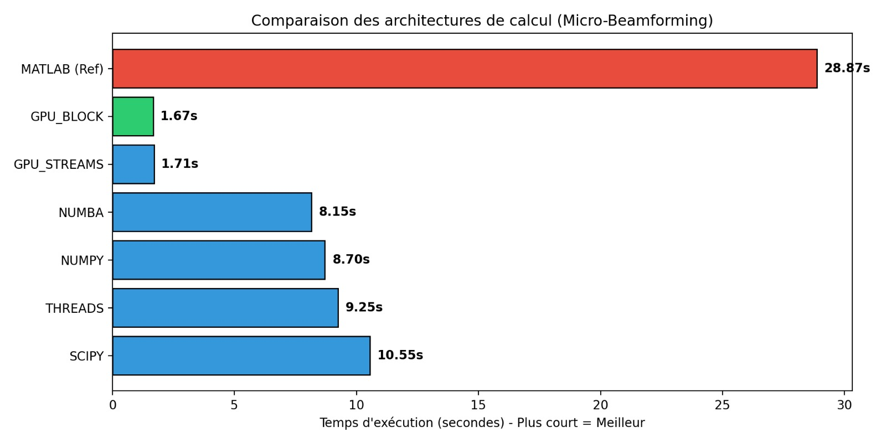

# UItrasonic Beamforming Performance Benchmark

Ce dépôt présente les résultats d'optimisation et d'accélération matérielle d'un algorithme de traitement d'ancrage (Delay-and-Sum) appliqué à l'imagerie ultrasonore (Micro-Beamforming). 

L'objectif principal de ce projet a été de concevoir une architecture logicielle modulaire en Python capable de remplacer une baseline de calcul existante sous MATLAB, tout en maximisant l'utilisation des architectures CPU multi-coeurs et GPU en environnement de production Windows.

*Note : Pour des raisons de confidentialité et de secret industriel, le code source propriétaire et les données d'acquisitions réelles ne sont pas partagés sur ce dépôt public.*

## Architecture du Projet

Le code a été entièrement restructuré pour isoler la logique métier des moteurs d'exécution. L'implémentation repose sur un cœur de calcul (`beamformer.py`) capable d'interpeler dynamiquement différents backends d'accélération :
* **Moteur CPU Standard** : Baseline vectorisée sous NumPy.
* **Moteur CPU Multithreadé** : Parallélisation via Numba (JIT compilation).
* **Moteur GPU Parallèle** : Implémentation massivement parallèle via CuPy (CUDA).

## Résultats Globaux

La figure ci-dessous compare les temps d'exécution requis pour traiter un volume complet de signaux rétrodiffusés selon l'architecture sélectionnée.

L'implémentation du moteur GPU par blocs (`GPU_BLOCK`) permet d'abaisser le temps de traitement de **28,87 secondes** (référence MATLAB) à **1,67 seconde**, soit un facteur d'accélération d'environ **x17** sans altération de la précision du signal.

## Analyse Approfondie

Pour consulter le journal de bord des mesures, l'analyse fine des goulots d'étranglement (profilage des fonctions de transfert de données CPU-GPU) ainsi que les preuves de validation du signal, rendez-vous sur le fichier dédié :

➡️ **[Consulter le Journal de Performance (PERF_LOG.md)](./PERF_LOG.md)**

## Technologies Utilisées
* **Langages** : Python, MATLAB (Référence)
* **Calcul Scientifique** : NumPy, SciPy, CuPy (CUDA)
* **Compilation à la volée** : Numba (JIT)
* **Profilage** : cProfile, Matplotlib
